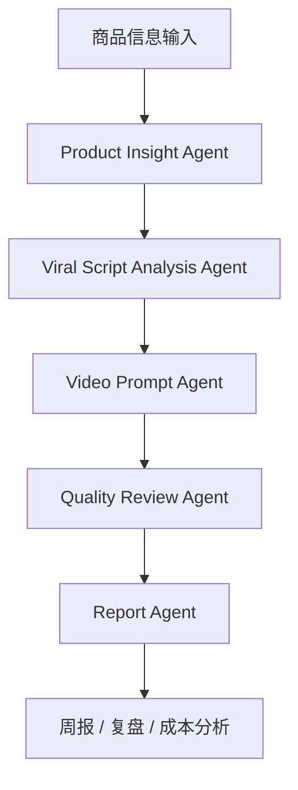

# AutoCommerce-Agent

AutoCommerce-Agent 是一个面向跨境电商短视频生产的多 Agent 自动化工作流项目，目标是把“商品分析 → 爆款结构拆解 → 短视频脚本 → 多模型提示词 → 质量评估 → 产能复盘”串成一套可复用的 AI 内容生产流水线。

项目适用于 TikTok 跨境电商内容团队，尤其适合 T 恤、百货、摩配、个护、家居小商品等需要批量生产带货短视频的业务场景。

---

## 核心价值

传统电商短视频生产存在几个典型问题：

1. 商品卖点依赖人工经验，脚本质量不稳定。
2. 爆款视频只能人工拆解，复用效率低。
3. 不同视频模型的提示词格式不同，难以规模化管理。
4. 生成后缺少统一质检标准，运营反馈难以沉淀。
5. 团队产能、成本、失败原因无法自动复盘。

AutoCommerce-Agent 将这些流程拆成多个 Agent，由不同 Agent 各自负责明确任务，最后通过 Workflow 串联。

---

## 系统架构



---

## Agent 模块

### 1. Product Insight Agent

负责分析商品信息，输出：

- 商品核心卖点
- 用户痛点
- 目标市场消费心理
- 本地化表达方向
- 适合的视频切入角度

### 2. Viral Script Analysis Agent

负责拆解爆款结构，输出：

- 前 3 秒钩子
- 镜头节奏
- 卖点出现顺序
- 转化触发点
- 可复用脚本模板

### 3. Video Prompt Agent

负责生成不同视频模型可用的结构化提示词，支持：

- VEO 风格提示词
- Seedance 风格提示词
- WAN 本地模型提示词
- 封面图提示词

同时会根据商品和动作复杂度给出风险判断。

### 4. Quality Review Agent

负责生成质检标准和视频评分维度：

- 商品一致性
- 动作自然度
- 画面真实感
- AI 感
- 穿模风险
- 投放可用性

### 5. Report Agent

负责将项目过程总结为管理报表：

- 每日/每周产能
- 模型使用成本
- 失败原因
- 可复用模板
- 下周优化方向

---

## 快速开始

### 1. 安装依赖

```bash
pip install -r requirements.txt
```

### 2. 运行命令行 Demo

```bash
python backend/app.py --case examples/tshirt_case.json
```

### 3. 运行 Streamlit 前端

```bash
streamlit run frontend/streamlit_app.py
```

---

## 示例输入

```json
{
  "product_name": "Oversized Graphic T-Shirt",
  "category": "T-Shirt",
  "target_market": "Indonesia",
  "selling_points": [
    "oversized fit",
    "soft cotton fabric",
    "streetwear graphic print"
  ],
  "model_preference": "VEO",
  "price_positioning": "affordable daily wear"
}
```

---

## 示例输出

系统会自动生成：

- 商品卖点分析
- TikTok 短视频脚本
- 3 段式分镜
- VEO / Seedance / WAN 提示词
- 质检评分表
- 成本与产能复盘

---

## 项目路线图

- [x] 多 Agent 基础结构
- [x] 商品案例输入
- [x] 脚本与提示词生成
- [x] 质检评分规则
- [x] Streamlit 可视化 Demo
- [ ] 接入真实 LLM API
- [ ] 支持批量 Excel 导入
- [ ] 支持视频截图自动质检
- [ ] 支持团队产能看板
- [ ] 支持多语言本地化文案生成

---

## License

MIT
