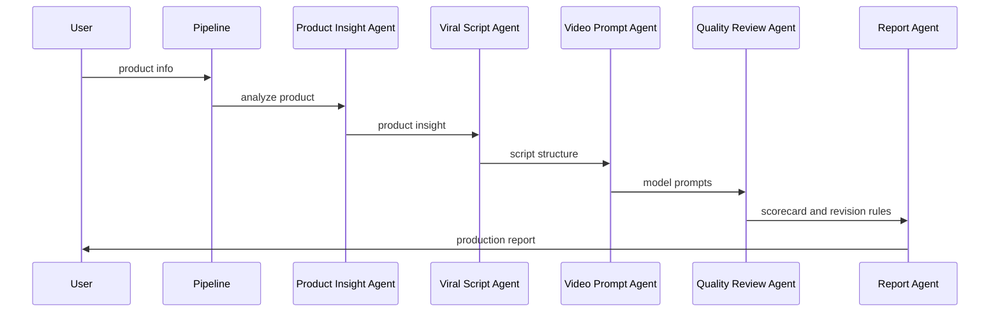

# System Design

AutoCommerce-Agent uses a multi-agent pipeline. Each agent handles a specific stage in the e-commerce short-video production process.

## Pipeline

1. Product Input
2. Product Insight Agent
3. Viral Script Analysis Agent
4. Video Prompt Agent
5. Quality Review Agent
6. Report Agent

## Design Principles

- Every Agent has a clear input and output.
- Prompts and scripts are structured, not free-form.
- The workflow is optimized for repeatable production.
- Quality review standards are separated from generation logic.
- Cost control is part of the workflow, not an afterthought.

## Data Flow

